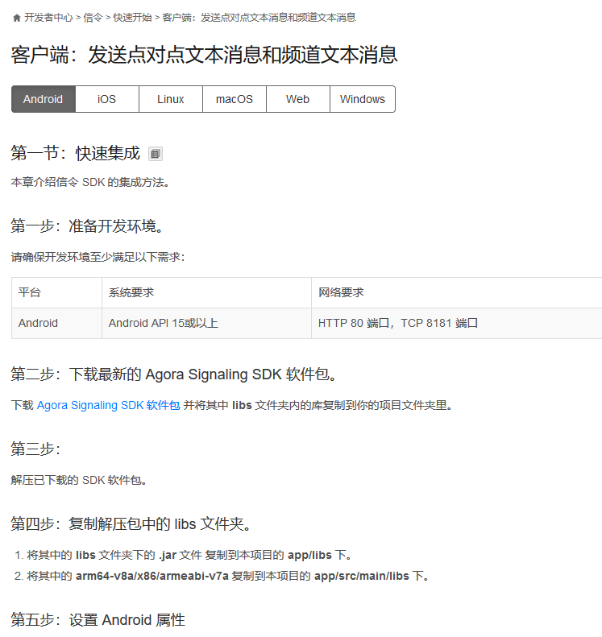
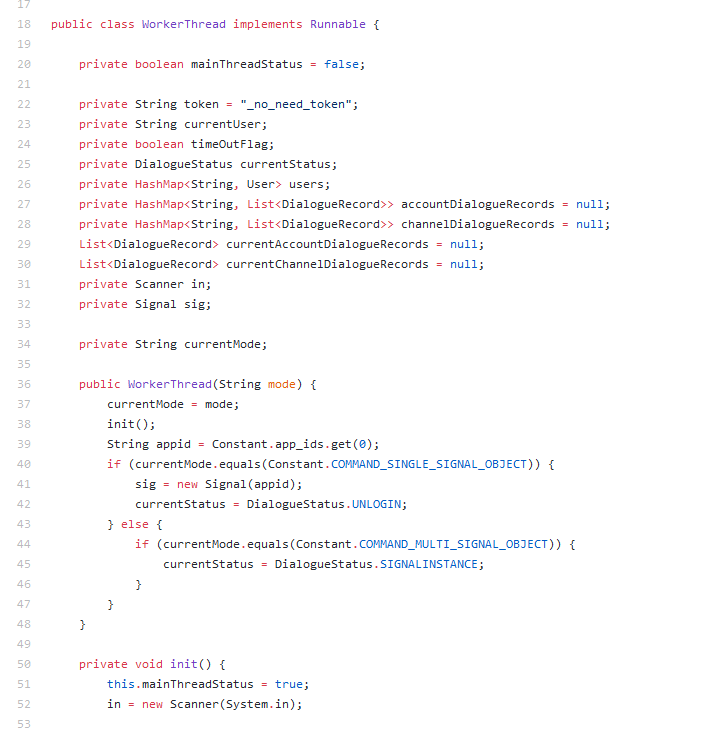

社会高度发展的今天，大家都离不开社交和社交网络。近几年，直播行业的稳定高速发展，背后隐藏一个事实，大家需要一个实时性更高的互联网环境，就像面对面沟通那样的及时有效。

这次要探索的是 **声网** 的产品 **Agora Signaling**, 一套简单易用的实时通信SDK。

官宣只要6步即可实现实时点对点消息通信。

<!-- more -->
# 初识 Agora Signaling

  Agora Signaling 是Agora 全家桶一员，主要用来实现即时点对点通信。如果你的雇主要你做一个在线的实时聊天室，要求承载在线人数大于3k, 并且不能有高延迟，这种情况下， Agora Signaling SDK 就是一个很好的选择。

  Agora Signaling SDK 提供了一整套高并发的API , 逻辑清晰，开箱即用。

  值得一提的是，Agora Signalling 是作为 插件的形式 服务于 Agora 全家桶，也可以单独用于实时消息通信的场景，甚至集成到其它方案中。

  点对点通信、呼叫邀请、频道消息、用户/频道属性维护全部不在话下。

  Agora 在全球搭建了专为实时传输而生的软件定义实时网 SD-RTN™ ，每月为全球200多个国家和地区客户提供超过100亿分钟的实时音视频技术服务，这种硬背景决定了Agora 产品的实时性和可靠性。

## SDK

  Agora 的 SDK 适配的常见的开发环境。端上、server，各种运行环境都有demo可供参考。

  [SDK 传送门](https://docs.agora.io/cn/Signaling/downloads) 

  [https://docs.agora.io/cn/Signaling/downloads](https://docs.agora.io/cn/Signaling/downloads)

## 文档

  Agora 官网已经提供了比较完善的文档资料。

  以 Agroa Signaling 为例，我们可以看到官网分别就客户端集成和服务端集成进行了介绍，而客户端部分又针对常见客户端实现进行的清晰简单的讲解。
  
  拥有一定开发经验的攻城狮很快便能上手。

  

  当然我们也发现一个问题，文档上只有 quick start, 没有进一步介绍接口使用的注意事项。带着这个疑惑，笔者迅速浏览了**API参考**部分，所有接口都没有提供具体的demo code 和注意事项。

## 基本接入思路

  1. 初始化

    创建实例

    getInstance

    回调设置

    callbackSet

  2. 登录

    login2

  3. 点对点消息

    发消息

    messageInstantSend

    收消息

    onMessageInstantReceive

  4. 频道消息

    进频道

    channelJoin

    发频道消息

    messageChannelSend

    收频道消息

    onMessageChannelReceive

    离开频道

    channelLeave

  5. 呼叫邀请

    发起呼叫邀请

    channelInviteUser2

    接受呼叫邀请

    channelInviteAccept

    拒绝呼叫

    channelInviteRefuse

    结束呼叫

    channelInviteEnd

  6. 注销

    logout

## demo 

  Agroa 官网提供了关于 Agora-Signaling 的各种demo，初略浏览一番，代码质量都不错，比较容易看懂，没有什么很奇怪的写法。

  

  但是，这些demo都有一个可怕的问题，没有注释。这对不曾接触Agora产品的新手不是特别友好，可能要花比较多精力来熟悉这些接口。

  后续，笔者会专门出几篇专题文章，带大家一起探索Agora黑科技。

## 可能的一些应用场景

  通过Agora 官网及已经公布的API 。我们可以了解到，常见带身份信息的文本聊天完全不在话下，基于Agora Signaling的demo,我们只要关心一下自己的业务模型，端上套个皮就能实现聊天室、留言板等互动交流场景。

### 直播间的弹幕聊天

  直播间聊天和弹幕聊天，本质上就是一个留言板和即时通讯的合体。而Agora Sinaling 本身就是为实时通信互动而生，实现这样的功能只要加一个聊天数据库来保留历史记录即可。

### 医患远程诊断
  
  现实生活中，受距离、时间、心理等诸多因素影响，病患并不一定能及时到达医院，医生也未必能及时到达现场，这时候及时通讯网络可以提供诸多方便。病患或病患家属可以通过一个App 将患情通过 影像、声音、文字传递给医生，同时可以随时的沟通，就像现场问诊一样，病患可能也需要一个病友群或频道来分享交流。

### 消息通知

  相信大家对手机短信、微信消息、qq消息都不陌生，我们借助 Agora Sinaling 也是可以实现简单版本的网络短信功能的。

### 客服功能

  有些产品可能需要一个客服功能，这样遇到使用问题时，可以随时通过聊天窗口咨询，而且不需要额外的添加客服人员的微信。有效沟通，同时保护彼此隐私。

### 实时性比较高的设备间通信

  比如我在A省有一批矿机，需要及时的了解机房状况，那么我在机房可以设置一个通信机，将采集到的数据通过 Agora Signaling 及时传回并记录在数据库。虽然这个场景可能并不是Agora Signaling 设计初衷，但作为一种可行的备选也是不错的。

### Mooc 课堂在线互动

  各种mooc 学堂的远程授课方案，包括远程考试等， 课堂互动可不局限于文字、语音、图像，通常要结合起来。

### 直播导购互动

  如果有这样一种直播活动，画面上和电视导购没什么区别，但是可以通过更方便的方式下单，扫码，沟通，填写信息，付款，获取订单状态，以及端上的现场互动等。

### 科研领域

  需要远程采集观测的各种数据等。实验展示等。实验数据实时采集处理等。

几乎能想到的任何需要 实时通信、点对点通信、或者分频道通信的场景，都大可以 祭出 Agora Signaling。

# 对比其它厂商

  和业界大厂相比较，Agora Signaling的优势在于灵活，高并发，迭代快速。

  缺点主要集中在文档质量方面，比如网易的即时通讯 demo 带有导读文档。任何一个新手都可以跟着导读快速熟悉SDK。

  腾讯则把各种常用的功能模块做成现成sdk。

  Agora 基于RTC和软定义网络实现高性能即时通讯服务，可以很好的为中小型企业或开发团队提供完整且灵活的方案。相比较下，一些大厂方案，可能需要分别调研和组合使用，容易分散开发者精力。

# 上手开发

