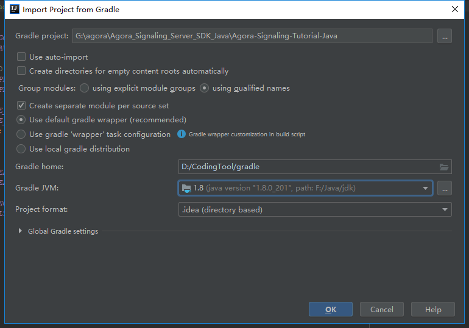
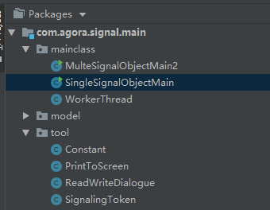
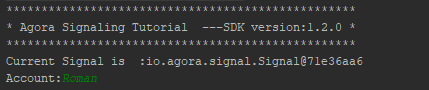
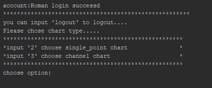
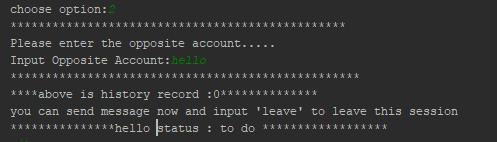
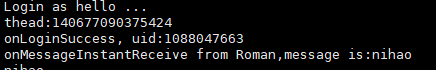
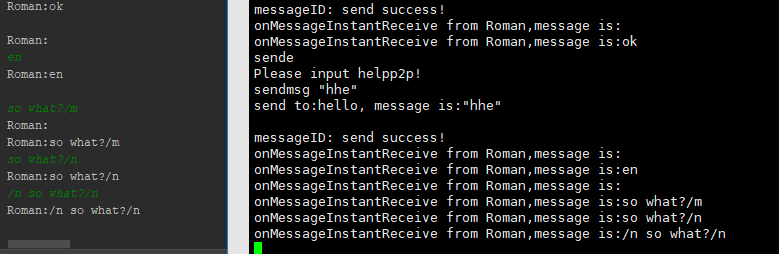
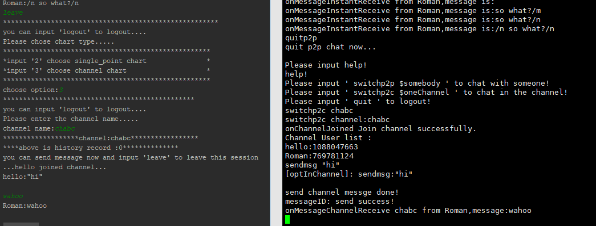

# quickstart

  这篇，直接上手demo，开启踩坑之旅。一起学习一下 server SDK的demo。

<!-- more -->
  

## 准备

  笔者体验环境：
  - windows10 x64
  - IntelliJ IDEA 2018.3.2 x64 
  - [sdk]()
  - [jdk1.8]()

  

## sdk 目录

  解压sdk，得到如下目录结构，我们后续会基于其中的samples : Agora-Signaling-Turorial-Java 来学习和理解server端sdk和api
  ```
  └─Agora_Signaling_Server_SDK_Java  // sdk根目录
    ├─lib // 信令的jar包
    ├─libs-dep // 行令依赖的jar包
    └─samples // 一个栗子
      └─Agora-Signaling-Tutorial-Java
        ├─gradle // 由此可以判断时gradle项目
        │  └─wrapper
        ├─lib // 这里已经又全部需要的jar包了，需要用sdk中 lib、libs中的jar包覆盖
        └─src
          └─main
            └─java
              ├─mainclass
              ├─model
              └─tool
  ```

## 导入为idea项目

  前面我们简单预览sdk目录，一个gradle项目。非常容易导入idea。这里就以idea搭建demo运行环境。
  
  1. 进入 Agora-Signaling-Tutorial-Java
  2. 右键--> Open Folder as InterlJ Idea project
  3. 等待导入完成，通常都很快
  

## 配置

  1. 配置sdk

      确保sdk目录下的lib、libs-dep 中的所有jar包到项目的lib目录下。

  2. 查看并修改build.gradle
    
      **注意第14行** 

      `dir: 'lib', include: ['* .jar']` 
      
      修改为：

      `dir: 'lib', include: ['*.jar']`

      星号*后没有空格

      修改后的build.gradle

      ```
      group 'com.agora'
      version '1.0-SNAPSHOT'
      apply plugin: 'java'
      sourceCompatibility = 1.5
      repositories {
          jcenter()
      }
      dependencies {
          testCompile group: 'junit', name: 'junit', version: '4.11'
          compile fileTree (dir: 'lib', include: ['*.jar'])
      }
      ```

      gradle配置发生变化时，idea提示 **import Changes** ,点一下 **import Changes** .

      确保gradle成功引入了依赖jar包。

  3. 配置appid

      > tip: 这里需要注意， agora 有两种鉴权机制。直接用appid,或者使用token。为方便演示，我们直接用appid完成鉴权，但是，笔者也同时搬来了java的token算法。具体看 第 4 步介绍。

      切换到 **Pancages** 视角，找到 **tool/COnstant**

      注意 8 ~ 11 行 ，

      ```
      static {
        //app_ids.add("Your_appId");
        //app_ids.add("Your_appId");
      }
      ```

      这里我们取消一行注释， 替换其中的Your_appId 为真实的appid, [获取 App ID ](https://docs.agora.io/cn/Agora%20Platform/key_signaling#GetAnAppID)。

      ```
      static {
        //app_ids.add("Your_appId");
        app_ids.add("174e657c6762ec0bcb7f4404d7ba9ad8");
      }
      ```
      
  4. 计算token 
      
      > tips: 只有在开启app认证时，才会用到token。这里方便演示，笔者决定暂时不开启app认证。笔者仅仅模仿并贴出相关代码

      具体实现:

      ```
      package tool;

      import java.security.MessageDigest;
      import java.security.NoSuchAlgorithmException;

      public class SignalingToken {

          public static String getToken(String appId, String certificate, String account, int expiredTsInSeconds) throws NoSuchAlgorithmException {

              StringBuilder digest_String = new StringBuilder().append(account).append(appId).append(certificate).append(expiredTsInSeconds);
              MessageDigest md5 = MessageDigest.getInstance("MD5");
              md5.update(digest_String.toString().getBytes());
              byte[] output = md5.digest();
              String token = hexlify(output);
              String token_String = new StringBuilder().append("1").append(":").append(appId).append(":").append(expiredTsInSeconds).append(":").append(token).toString();
              return token_String;
          }

          public static String hexlify(byte[] data) {

              char[] DIGITS_LOWER = {'0', '1', '2', '3', '4', '5',
                      '6', '7', '8', '9', 'a', 'b', 'c', 'd', 'e', 'f'};
              char[] toDigits = DIGITS_LOWER;
              int l = data.length;
              char[] out = new char[l << 1];
              // two characters form the hex value.
              for (int i = 0, j = 0; i < l; i++) {
                  out[j++] = toDigits[(0xF0 & data[i]) >>> 4];
                  out[j++] = toDigits[0x0F & data[i]];
              }
              return String.valueOf(out);
          }
      }
      ```

      更具体的可以参考 [java版token算法实现](https://github.com/AgoraIO/Tools/blob/master/DynamicKey/AgoraDynamicKey/java/src/main/java/io/agora/signal/SignalingToken.java)

      关于鉴权机制及算法 [详情见](https://docs.agora.io/cn/Agora%20Platform/key_signaling#GetAnAppID)


## 运行demo

  1. 在启动前，有必要来一起看看 mainclass目录。

      启动类有两个， 一个是启动点对点通信server的, 另一个是频道消息。

      怎么理解呢，其实很简单，点对点通信，你可以理解为俩人窃窃私语。频道通信则是群聊（像微信群）。

      ```
      └─src
        └─main
          └─java
            ├─mainclass
            │   MulteSignalObjectMain2.java  // 频道消息 启动类
            │   SingleSignalObjectMain.java  // 点对点通信 启动类
            │   WorkerThread.java // 核心业务流程
      ```
      
  2. 尝试通信

      1. 启动

          选中 SingleSignalObjectMain.java --> ctrl + shift + f10
      
          

      2. 输入自己的accout 

          run 选项卡中已经提示你输入 account ，我们随便输入一个 Roman

          后续可以尝试自己实现用户中心

          

      3. 选择模式并发送消息

          然后， 会看到提示 successd

          

          这里，先一起试试 点对点通信 ，输入 2 ，回车

          我们输入聊天的对象，hello

          

          顺便开个linux虚拟机运行linux客户端demo

          
          
          互相发消息

          

          这里比较奇怪，demo可能有些功能业务省略掉了，java端可以发点对点消息，却收不到。

          尝试发频道消息，发现群聊频道模式完全没问题。
          


  3. 小结

      启动demo没有什么难度，不过demo里的业务怎么样，需要大家花些心思来学习。

## code review (java)

  demo跑起来了，但是我们并不是很明白这个程序具体业务。换自己来写，可能还是一脸懵。所以，笔者决定review code，学习一下sdk用法
  
### src\main\java\tool\Constant.java

  大部分写死的和预定义的参数值都在这里

  ```
  package tool;

  import java.util.ArrayList;

  public class Constant {
    public static int CURRENT_APPID = 0;
    public static ArrayList<String> app_ids = new ArrayList();
    // 申明一些 命令，这些命令通常都是些常量
    
    public static String COMMAND_LOGOUT;
    public static String COMMAND_LEAVE_CHART;
    public static String COMMAND_TYPE_SINGLE_POINT;
    public static String COMMAND_TYPE_CHANNEL;
    public static String RECORD_FILE_P2P;
    public static String RECORD_FILE_CHANEEL;
    public static int TIMEOUT;
    public static String COMMAND_CREATE_SIGNAL;
    public static String COMMAND_CREATE_ACCOUNT;
    public static String COMMAND_SINGLE_SIGNAL_OBJECT;
    public static String COMMAND_MULTI_SIGNAL_OBJECT;

    public Constant() {
    }

    static {
      // 前面声明的变量名，这里复制
      // app_ids 是数组格式的，意味你可以添加多个appid
      app_ids.add("073e6cb4f3404d4ba9ad454c6760ec0b");  

      // 一些命令 定义
      // 退出登陆
      COMMAND_LOGOUT = "logout";
      // 离开当前聊天绘画
      COMMAND_LEAVE_CHART = "leave";
      // 私聊模式输入2
      COMMAND_TYPE_SINGLE_POINT = "2";
      // 群聊模式输入3
      COMMAND_TYPE_CHANNEL = "3";
      // 缓存文件定义
      RECORD_FILE_P2P = "test_p2p.tmp";
      RECORD_FILE_CHANEEL = "test_channel.tmp";
      // 超时
      TIMEOUT = 20000;
      // 新建 一个signal
      COMMAND_CREATE_SIGNAL = "0";
      // 新建一个用户
      COMMAND_CREATE_ACCOUNT = "1";
      // 进入点对点模式
      COMMAND_SINGLE_SIGNAL_OBJECT = "0";
      // 进入频道群聊模式
      COMMAND_MULTI_SIGNAL_OBJECT = "1";
    }
  }
  ```

### 启动类

  以 点对点 为例：

  ```
  //
  // Source code recreated from a .class file by IntelliJ IDEA
  // (powered by Fernflower decompiler)
  //

  package mainclass;

  import tool.Constant;
  // 一个点对点启动类
  public class SingleSignalObjectMain {
    // 构造方法
    public SingleSignalObjectMain() {
    }
    // main 方法接受 字符串数组作为参数
    public static void main(String[] args) {
      // new 一个workerThread ，核心业务都在workerThread 类中
      WorkerThread workerThread = new WorkerThread(Constant.COMMAND_SINGLE_SIGNAL_OBJECT);
      // 启动这个workerThread 线程。 
      (new Thread(workerThread)).start();
    }
  }


  ```

### model中定义了一些数据类和类方法，比较容易理解

### main/java/mainclass/WorkerThread.java

  这里定义了一个线程类，继承Runable

  限于篇幅，这里摘部分代码出来解读一下。

  首先， WorkerThread类中定义

  ```
  private boolean mainThreadStatus = false; // 主线程状态 默认false
  private String token = "_no_need_token"; // 默认未开启token认证，而是直接使用appid
  private String currentUser; // 当前会话用户
  private boolean timeOutFlag; // 超时标记，是否超时
  private DialogueStatus currentStatus; // 当前消息状态
  private HashMap<String, User> users; // 用户表
  private HashMap<String, List<DialogueRecord>> accountDialogueRecords = null; // 账号会话记录
  private HashMap<String, List<DialogueRecord>> channelDialogueRecords = null; // 频道会话记录
  List<DialogueRecord> currentAccountDialogueRecords = null; // 当前账号会话记录
  List<DialogueRecord> currentChannelDialogueRecords = null; // 当前频道会话记录
  ```

  重点看一下构造方法，

  ```
  /**
  public WorkerThread(String mode) {
      currentMode = mode; //传入mode
      init(); // 初始化
      String appid = Constant.app_ids.get(0); // 获取配置文件的里的app_id

      // 如果传入mode值等于COMMAND_SINGLE_SIGNAL_OBJECT的值（点对点），用appid new 一个信令，更新会话状态为为登陆状态
      // 否则判断是否为频道模式，更新状态。 这里，大家可以根据自己情况修改逻辑。
      // 这里有个疑问，两个分支里，为啥一个需要 new Signal 一个不需要呢？
      if (currentMode.equals(Constant.COMMAND_SINGLE_SIGNAL_OBJECT)) {
          sig = new Signal(appid);
          currentStatus = DialogueStatus.UNLOGIN;
      } else {
          if (currentMode.equals(Constant.COMMAND_MULTI_SIGNAL_OBJECT)) {
              currentStatus = DialogueStatus.SIGNALINSTANCE;
          }
      }
  }
  ```
  init() function 则初始化一个必要的需要交互输入来初始化的数据

  run() function 会根据currentStatus的值来调用不同的业务函数


  makeSignal() 中非常关键的一步

  ```
  Signal signal = new Signal(appId); //用id实例化信令
  ```

  joinChannel(String channelName) 中用到 LoginSession 类 和Channel类

  ```
   public void joinChannel(String channelName) {
        final CountDownLatch channelJoindLatch = new CountDownLatch(1);
        // 实例化Channel 类 ，里面override几个事件监听
        Channel channel = users.get(currentUser).getSession().channelJoin(channelName, new Signal.ChannelCallback() {
            // 当加入频道时
            @Override
            public void onChannelJoined(Signal.LoginSession session, Signal.LoginSession.Channel channel) {
                channelJoindLatch.countDown();
            }
            // 频道用户列表发生变化时
            @Override
            public void onChannelUserList(Signal.LoginSession session, Signal.LoginSession.Channel channel, List<String> users, List<Integer> uids) {
            }

            // 收到频道消息时
            @Override
            public void onMessageChannelReceive(Signal.LoginSession session, Signal.LoginSession.Channel channel, String account, int uid, String msg) {

                if (currentChannelDialogueRecords != null && currentStatus == DialogueStatus.CHANNEL) {
                    PrintToScreen.printToScreenLine(account + ":" + msg);
                    DialogueRecord dialogueRecord = new DialogueRecord(account, msg, new Date());
                    currentChannelDialogueRecords.add(dialogueRecord);
                }

            }
            // 当频道用户加入会话时
            @Override
            public void onChannelUserJoined(Signal.LoginSession session, Signal.LoginSession.Channel channel, String account, int uid) {
                if (currentStatus == DialogueStatus.CHANNEL) {
                    PrintToScreen.printToScreenLine("..." + account + " joined channel... ");
                }
            }

            @Override
            public void onChannelUserLeaved(Signal.LoginSession session, Signal.LoginSession.Channel channel, String account, int uid) {
                if (currentStatus == DialogueStatus.CHANNEL) {
                    PrintToScreen.printToScreenLine("..." + account + " leave channel... ");
                }
            }

            @Override
            public void onChannelLeaved(Signal.LoginSession session, Signal.LoginSession.Channel channel, int ecode) {
                if (currentStatus == DialogueStatus.CHANNEL) {
                    currentStatus = DialogueStatus.LOGINED;
                }
            }

        });
        timeOutFlag = false;
        wait_time(channelJoindLatch, Constant.TIMEOUT, channelName);
        if (timeOutFlag == false) {
            // 未超时，加入频道
            users.get(currentUser).setChannel(channel);
        }

    }
  ```

  这里篇幅有限，不能贴出全部代码。大家可以对着api文档来 着重看一下如何认证，如何登陆，如何收发消息。

  后续，笔者会上传注释过的到github。

# 可能会遇到的问题-应对方法

  1. demo的build.gradle 中多了一个空格，导致提示找不到lib

      解决方法： * .jar  --> *.jar
  
  2. 实例化signal时失败

      解决方法： 检查appid是否正确，检查是否开启了token认证

        如果开启了token认证，需要增加token计算算法，[参考](https://github.com/AgoraIO/Tools/blob/master/DynamicKey/AgoraDynamicKey/java/src/main/java/io/agora/signal/SignalingToken.java)

  3. 笔者发现两个启动类虽然默认启动命令值不一样，但是其实启动效果一样，都可以选择切换p2p或者channel模式。

